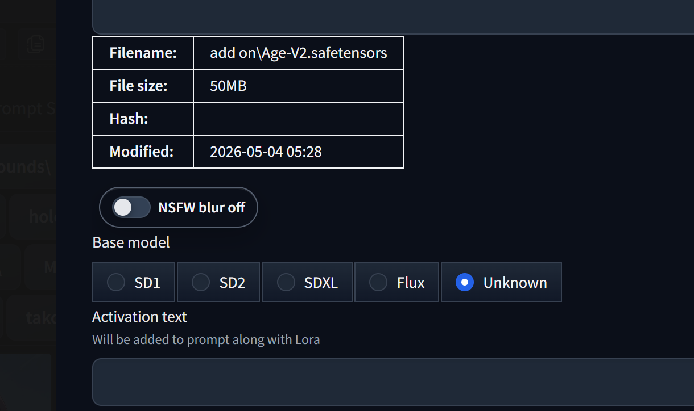
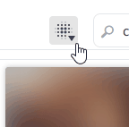
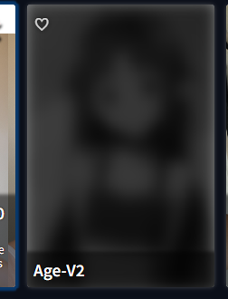
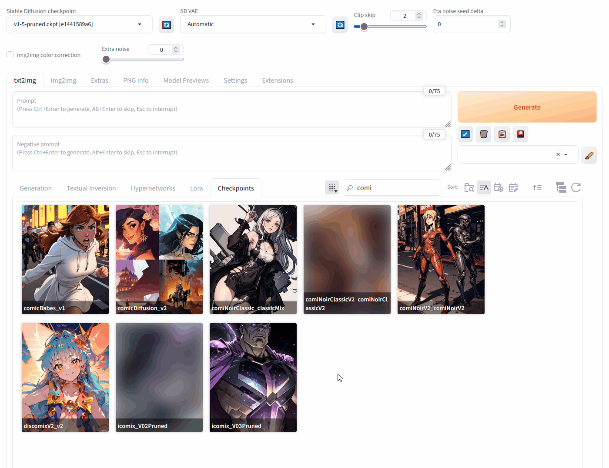
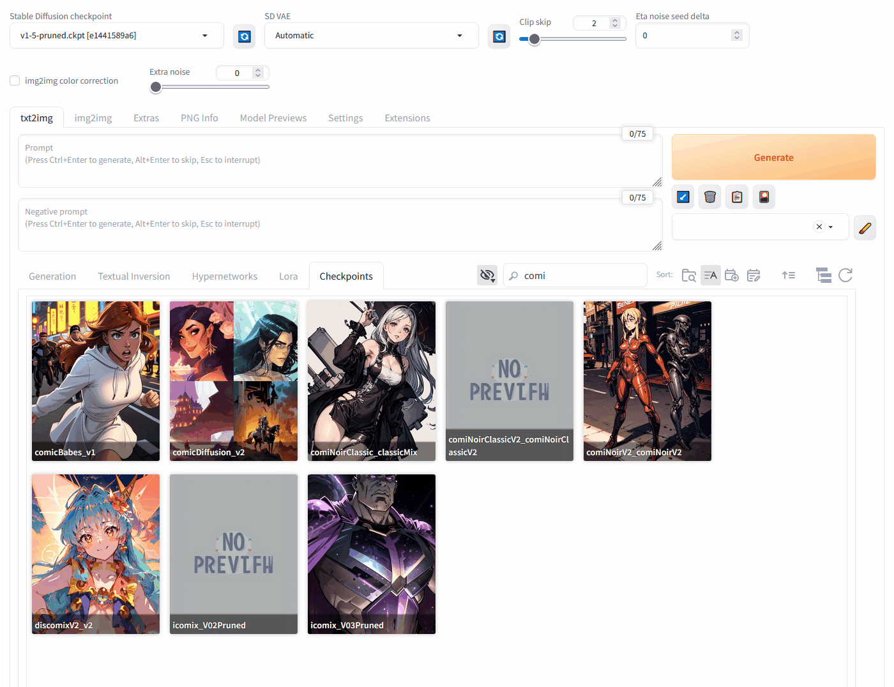

# Forge NSFW Card Blur

A small Stable Diffusion WebUI Forge / A1111 Extra Networks extension for blurring or hiding selected card thumbnails.

This extension does not analyze generated images and does not filter your output images. It only affects thumbnails shown in the Extra Networks card browser, such as LoRA cards.

## Features

- Blur, hide, or show marked Extra Networks card thumbnails.
- Use a lighter real-time blur, darken, and desaturate preview in Blur mode instead of applying a very heavy browser blur filter to every marked card while scrolling.
- Apply the blur effect only to visible card thumbnails, so off-screen cards do not pay the filter cost until they scroll into view.
- Hover a blurred card to temporarily reveal the original thumbnail.
- Mark individual cards from the card metadata popup with a compact `NSFW blur on/off` toggle.
- Save per-card choices on the Forge machine in `data/marked_cards.json`, not in browser local storage.
- Use a small Extra Networks toolbar button to switch between `Blur`, `Hide`, and `Show` modes.

## Usage

Open an Extra Networks card metadata popup, then toggle `NSFW blur on/off` below the file metadata table.



The global toolbar mode controls how marked cards behave:

- `Blur`: blur, darken, and desaturate marked thumbnails. Hovering over the card reveals the original thumbnail.
- `Hide`: hide marked thumbnails entirely.
- `Show`: show all thumbnails normally.

The toolbar mode is temporary for the current UI session. To change the default, open Forge `Settings` and search for `Forge NSFW Card Blur`.

## Toolbar Mode

Use the Extra Networks toolbar button to switch between blur, hide, and show behavior without changing the saved default setting.



## Blur

Marked cards use a lighter real-time CSS filter (`blur(8px) brightness(0.24) saturate(0)`) instead of the older strong blur. The filter is only enabled for card thumbnails that are in or near the viewport. The original thumbnail stays in the card and is not replaced, so the Extra Networks metadata editor still sees the normal preview image.

Hovering over a blurred card temporarily reveals the original thumbnail, so browsing keeps the old behavior while avoiding the cost of strongly blurring many thumbnails during scroll.

  

ꜜꜜ Origianl | New ꜛꜛ



## Hide

Marked cards are hidden completely. Hovering over the card will not reveal the thumbnail.



## Show

All card thumbnails are shown normally.


## Storage

Only the list of cards you marked for blur/hide is stored here:

```text
data/marked_cards.json
```

The blur effect itself is real-time CSS only. It does not create preview caches, replace your original preview images, or affect generated output images. The `data/` folder is ignored by git so personal card choices are not published with the extension.

## Installation

Install from Forge / A1111's Extensions tab, or clone this repository into your `extensions` folder:

```bash
git clone https://github.com/Merueru/forge-nsfw-card-blur.git extensions/forge-nsfw-card-blur
```

Restart the WebUI after installation.

## Credits

Based on [CurtisDS/stupid-nsfw-card-blur-a1111](https://github.com/CurtisDS/stupid-nsfw-card-blur-a1111)

Original project by CurtisDS. This version keeps the lightweight blur/hide/show behavior and adds explicit per-card metadata toggles, machine-local JSON storage, a lighter viewport-aware real-time blur preview mode, and Forge-focused UI polish.

Some toolbar/blur/show demo images are based on the original project preview assets and are kept under the same MIT license. Replace them with new screenshots any time.

## License

MIT License. See [LICENSE](LICENSE)
